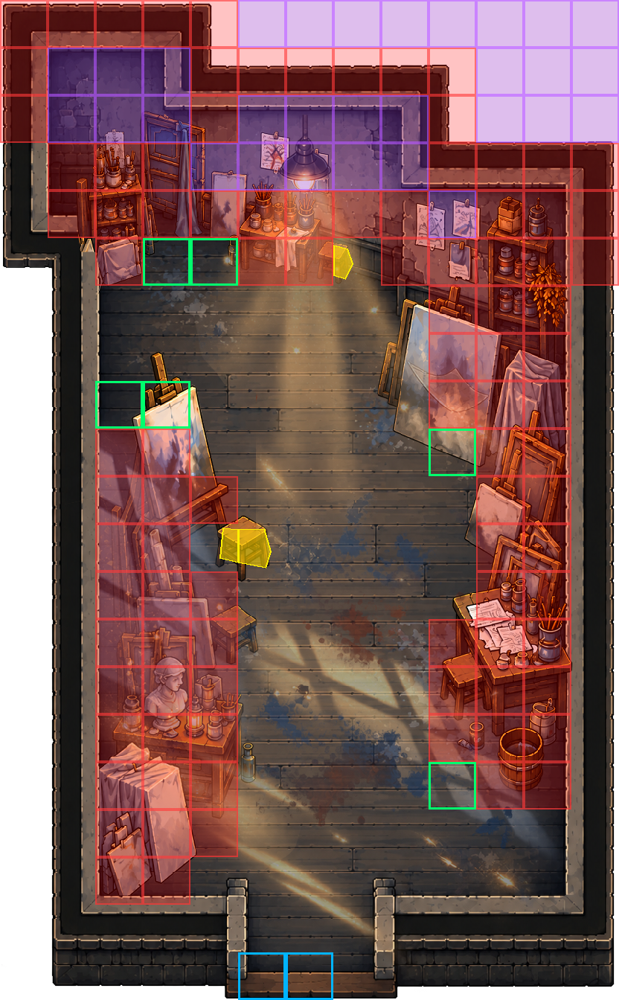

# ArtRoom_01 實裝與驗證記錄

完成日期：2026-09-25。未 Publish；Production_Main Catalog、GameScene、Runtime C# 均未修改。

## 實裝內容

- 沿用既有 P10.7 Factory 產生的 Room_ArtRoom_01.prefab，保留 Prefab GUID `cd42fed3d87328d44846b03c100ed781`。
- TemplateId `Production_ArtRoom_01`，13×21 格，HighPrecision，Standard，weight 10，floor 1–unlimited，每層最多 1，禁止旋轉。
- 四張交付 PNG 與現有 Runtime PNG 的 SHA-256 完全一致，因此保留既有圖片與 .meta，不做無意義覆寫。Unity 實際匯入確認 Sprite、Single、832×1344、64 PPU、中心 pivot、Point、無 mipmap、無壓縮。
- 四層保持相同位置、旋轉與縮放。排序依 Factory：Floor -10、Objects 0、Foreground 30、Effects 10。
- 保留 South_0，門寬 2，基準格 (6,0)，實際門格 (5,0)、(6,0)。既有 ClosedBlocker 與五段 Perimeter 經原 Factory 重建結果比對一致，予以保留。
- blockedCells 完整採用規格列出的 96 個 Unity 座標，未再次翻轉 Y；六個指定可走格均未列入 blockedCells。
- 經使用者確認，新增 Navigation/Colliders/HardBlocks：34 個靜態 BoxCollider2D，以同行相鄰格合併，精確覆蓋 96 格，不侵入其他格。
- Navigation/Colliders/Interior 只新增三個 PolygonCollider2D：Partial_07_15、Partial_04_09、Partial_05_09；三格保持可走。多邊形依圖片中的椅凳區域配置，使用原畫布像素座標換算，沒有移動或縮放圖片。

## 明確可走格與連通性

只填入 blockedCells 並保留預設矩形可走範圍時，177 個可走格形成 147、14、9、6、1 格五個連通分量。既有 R6 全圖連通驗證要求 FloorCells 全部連通。

因此使用既有 walkableCells 欄位，明確列出與南門連通的 147 格，排除上方牆面／外部的 30 個孤立格；沒有增加或刪除規格的 blockedCells，也沒有修改生成器。

六個強制可走格（Unity）：(2,12)、(3,12)、(3,15)、(4,15)、(9,11)、(9,4)。三個局部碰撞格也都在這 147 格中。

## 驗證方式與結果

使用 Unity 6000.0.26f1，在隔離專案副本中編譯現有 Runtime／Editor 腳本，呼叫原有 DreamRoomProductionPipelineP107.ValidatePrefabAsset（非仿製驗證），以及原 Factory Perimeter Builder 比對既有幾何。套用 Prefab 後逐格驗證實際 Collider 覆蓋，並執行門口射線及玩家尺寸 BoxCast。

隔離副本只將已安裝 PackageCache 版本映射為本機套件來源；原專案 Packages 檔案不變。執行的是無 GPU 的 batchmode 資產／物理檢查，並非畫面或完整遊玩驗收。現有腳本有舊 API 等編譯警告，不在本次修改範圍。

```text
PASS: Unity 6000.0.26f1 compiled project scripts
PASS: 96 unique supplied blocked cells
PASS: existing room identity/size
PASS: 147 door-connected walkable cells; 30 isolated wall/exterior cells excluded
PASS: walkable override/partial (2, 12)
PASS: walkable override/partial (3, 12)
PASS: walkable override/partial (3, 15)
PASS: walkable override/partial (4, 15)
PASS: walkable override/partial (9, 11)
PASS: walkable override/partial (9, 4)
PASS: walkable override/partial (7, 15)
PASS: walkable override/partial (4, 9)
PASS: walkable override/partial (5, 9)
PASS: reuse empty Factory Interior
PASS: one socket
PASS: South / width 2
PASS: Factory door cells (5,0), (6,0)
PASS: retained Factory perimeter count
PASS: retained perimeter Wall_North_0
PASS: retained perimeter Wall_East_0
PASS: retained perimeter Wall_South_0
PASS: retained perimeter Wall_South_1
PASS: retained perimeter Wall_West_0
PASS: DreamRoomTemplate validation
PASS: P10.7 ValidatePrefabAsset: 0 errors 
PASS: Floor 832x1344
PASS: Floor centered pivot / 64 PPU / 13x21 canvas; pivot=(416.00, 672.00) PPU=64
PASS: Floor Factory sorting order
PASS: Objects 832x1344
PASS: Objects centered pivot / 64 PPU / 13x21 canvas; pivot=(416.00, 672.00) PPU=64
PASS: Objects Factory sorting order
PASS: Foreground 832x1344
PASS: Foreground centered pivot / 64 PPU / 13x21 canvas; pivot=(416.00, 672.00) PPU=64
PASS: Foreground Factory sorting order
PASS: Effects 832x1344
PASS: Effects centered pivot / 64 PPU / 13x21 canvas; pivot=(416.00, 672.00) PPU=64
PASS: Effects Factory sorting order
PASS: 273 cell centers verified; hard area 96 in 34 row-merged colliders
PASS: three partial PolygonCollider2D only in Interior
PASS: solid partial confined to (7, 15)
PASS: solid partial confined to (4, 9)
PASS: solid partial confined to (5, 9)
PASS: closed door collision -1
PASS: closed door collision 0
PASS: open door clearance -1
PASS: open door clearance 0
PASS: player-size doorway sweep
Publish=False; P10.9 deferred because room is not in Production_Main. No original scene/catalog/runtime code changed.

```

## 修改檔案

- Assets/DreamDungeon/Production/Rooms/ArtRoom_01/Room_ArtRoom_01.prefab
- Documentation/ArtRoom_01_Implementation.md（本文件）
- Documentation/ArtRoom_01_CollisionReview.png（碰撞核對圖，不是遊戲貼圖）

回寫前以 SHA-256 比對原 Assets、Packages、ProjectSettings 快照，確認沒有其他檔案被修改；回寫後 Prefab 與通過驗證的副本完全一致。既有 ArtRoom_01 目錄原本即為 Git 未追蹤狀態，本次沒有代為提交。

## 最少人工驗收

1. Unity 開啟專案並等候匯入。若 Prefab Mode 仍保留舊的未儲存版本，先重新載入磁碟版本，避免覆蓋此次結果。
2. 選取 Room_ArtRoom_01.prefab，執行 Tools > Dream Dungeon > Production Rooms > P10.7 > 2. Validate Selected Production Room。自動驗證已通過，此步確認目前編輯器看到的是更新後資產。
3. Prefab Mode 檢視四層重疊與前景遮擋；在不儲存的臨時場景中實測南門通行、上方硬阻擋與三處椅凳邊緣，特別觀察既有敵人格心導航穿越部分碰撞格的表現。無 GPU 批次測試不能取代畫面、操作手感或完整敵人移動驗收。

暫不 Publish。P10.9 現有工具要求目標已在 Production_Main，故本次未執行其正式 Catalog Runtime Probe，也沒有把房間加入 Catalog。日後獲准發布且驗證通過後，才執行 Publish，再依 P10.9 的 Prepare / Play / Audit / Restore 流程驗收。

## 碰撞核對圖

紅色：96 個硬阻擋格；紫色：30 個從可走集合排除的孤立格；綠框：六個強制可走格；黃色：三處局部碰撞；藍框：兩個南門格。


